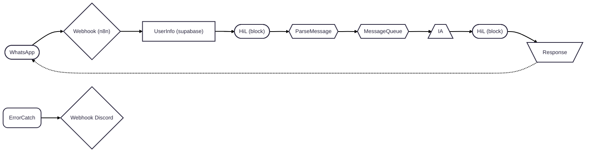

# ai-agents-n8n

WhatsApp AI Agent made with n8n

- Create a environment on VPS with Docker + [Coolify](https://coolify.io/)
- Deploy a [N8N](https://n8n.io/) distributed structure (Editor, Worker, Webhook)
- Configure [Supabase](https://supabase.com/), [Redis](https://redis.io/) and [PostgreSQL](https://www.postgresql.org/)
- Integrate with [Evolution API](https://doc.evolution-api.com/v1/pt/get-started/introduction) that will be the bridge to WhatsApp

## Installation

1. We used Hetzner to host our Coolify and other tools
2. Created a domain on HostGator (test-app-lucas.shop) and setup rule/register `A | *.test-app-lucas.shop.` to point to Hetzner server IP
3. We installed Coolify on Hetzner server by running this command via ssh: `curl -fsSL https://cdn.coollabs.io/coolify/install.sh | sudo bash`
4. Updated Coolify setting to point to https://coolify.test-app-lucas.shop
5. Created a project and add Supabase as a project resource on Coolify
6. Updated supabase domain to https://supabase.test-app-lucas.shop and deployed it
7. Created the `docker-compose.yml` to configure all the necessary containers for our infra WhatsApp N8N Agent
8. Update N8N and Evolution API domains

## Containers

- [N8N (main, worker and webhook)](https://docs.n8n.io/hosting/configuration/environment-variables/)
- Postgres
- Redis
- [Evolution API](https://doc.evolution-api.com/v1/pt/env)

## N8N
- We use the [Queue Mode](https://docs.n8n.io/hosting/scaling/queue-mode/)

