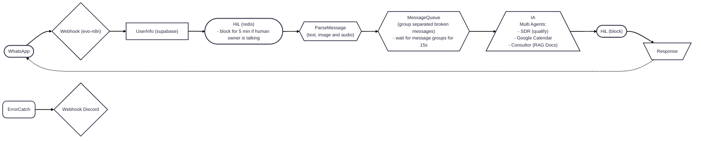

# ai-agents-n8n

An AI agent to generate, handle and qualify Leads om WhatsApp made with n8n, Coolify, Supabase, Evolution and more.

- Create a environment on VPS with Docker + [Coolify](https://coolify.io/)
- Deploy a [N8N](https://n8n.io/) distributed structure (Editor, Worker, Webhook)
- Configure [Supabase](https://supabase.com/), [Redis](https://redis.io/) and [PostgreSQL](https://www.postgresql.org/)
- Integrate with [Evolution API](https://doc.evolution-api.com/v1/pt/get-started/introduction) that will be the bridge to WhatsApp

## Installation & Setup

- We used Hetzner to host our Coolify and other tools
- Created a domain on HostGator (test-app-lucas.shop) and setup rule/register `A | *.test-app-lucas.shop.` to point to Hetzner server IP
- We installed Coolify on Hetzner server by running this command via ssh: `curl -fsSL https://cdn.coollabs.io/coolify/install.sh | sudo bash`
- Updated Coolify setting to point to https://coolify.test-app-lucas.shop
- Created a project and add Supabase as a project resource on Coolify
- Updated supabase domain to https://supabase.test-app-lucas.shop and deployed it
- Created the `docker-compose.yml` to configure all the necessary containers for our infra WhatsApp N8N Agent
- Update N8N and Evolution API domains
- Setup credentials on N8N
  - Supabase, postgres, redis: get credentials on Coolify
  - [OpenAI](https://platform.openai.com/api-keys): set credits and get API Token
  - [GCP](https://console.cloud.google.com/auth/clients?project=n8n-ai-whatsapp): enabled Docs, Drive and Calendar APIs. Setup a OAuth Client ID.
  - Discord: webhook
- Setup Hetzner Firewall to expose only ports 22 (ssh), 80 (http) and 443 (https)
- Implement n8n SDR workflows
  - You can use the yaml files located on `n8n/workflows` folder 

## Containers

- [N8N (main, worker and webhook)](https://docs.n8n.io/hosting/configuration/environment-variables/)
- Postgres
- Redis
- [Evolution API](https://doc.evolution-api.com/v1/pt/env)

## N8N
- We use the [Queue Mode](https://docs.n8n.io/hosting/scaling/queue-mode/)

## Helpers
- https://efficient-sloth-d85.notion.site/Desafio-Agentes-de-IA-com-n8n-na-pr-tica-25a395da57708012b45ce17b8f5c993f

## Troubleshooting
## Supabase consuming too much CPU
- run `docker stats --format "table {{.Name}}\t{{.CPUPerc}}\t{{.MemUsage}}"` on your server to check cpu and memory usage by containers
- If you see some container from supabase consuming too much resource check if you can stop it
  - e.g. supabase-vector container is related to logs and minor things and sometimes you don't use/need those  
